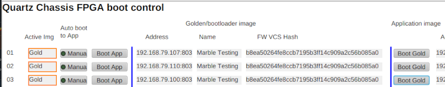

# Firmware update

Each Quartz device has a [Marble](https://github.com/BerkeleyLab/Marble) base board with 16MB flash chip.
This flash chip is partitioned in two 8MB sections.
The lower 8MB section will be delivered in a [protected/read-only](https://github.com/mdavidsaver/alluvium/blob/master/marble-protect.md) state.
The upper 8MB second is always writable.

Note: protection of the lower section should only be disabled as directed by Osprey support.

The lower section is delivered with a copy of the [Bedrock](https://github.com/BerkeleyLab/Bedrock) golden image bootloader firmware.
This firmware has the capability to rewrite the upper section.
When power is applied, the bootloader firmware is always loaded,
and will continue running until commanded to reload from the upper section.

The upper section contains the Quartz application firmware,
as well as [persistent configuration](FirmwareNotes.md).

Map of 16MB flash

| Base Address |                            |
|--------------|----------------------------|
| 0x000000     | Golden/bootloader firmware |
| 0x800000     | Application firmware       |
| 0xF00000     | Application configuration  |

## Preparation

The Quartz must be running the bootloader firmware.

If there are Quartz IOCs communicating with the device(s),
then Active Image status must show `Gold`.
Set auto-boot (`FDAS:##:GLD:autoboot`) to `Manual`,
then click `Boot Gold` (write `0` to `FDAS:##:FPGA:reboot`).
(see below)

Alternately, stop these IOCs.

If/when no Quartz IOC is running, then power cycle the devices
to ensure the bootloader image is running.



## Flash chip operations

The [Alluvium](https://github.com/mdavidsaver/alluvium) utility can
interact with the bootloader firmware to manipulate the flash chip.

The following examples use address `192.168.79.1`,
which should be substituted for the desired IP address(es),
and `/path/to/download.bit` substituted with the path to
a provided bitstream file.
Operations other than `read` may be performed on multiple device in [parallel](https://github.com/mdavidsaver/alluvium/blob/master/README.md#batch-operations).

### Communications check

First it is advised to issue a `status` to check connectivity.
If a timeout error occurs, check that the IP address is correct,
and that the device is on and running the bootloader image.

```
python -m alluvium 192.168.79.1 status
```

### Verification of loaded application firmware

Compare the loaded application firmware file (excluding configuration)
with a provided bitstream file.
On failure, prints an error and exits with a non-zero code.

```
python -m alluvium 192.168.79.1 verify app /path/to/download.bit
```

### Programming application firmware

The application image may be overwritten:

```
python -m alluvium 192.168.79.1 program app /path/to/download.bit
```

The `program` command has three stages: erase, program, and verify.
On failure, prints an error and exits with a non-zero code.

### Backup/restore of entire upper section

Reads and stores the entire upper section,
including both application firmware and persistent device specific configuration.

```
python -m alluvium 192.168.79.1 read app 8m -f BACKUP.bin
```

Erase and re-program the entire upper second.

```
python -m alluvium 192.168.79.1 program app BACKUP.bin
```

### Disaster recovery

If it is necessary to completely erase the upper section
to start from a different firmware with no persistent configuration.

```
python -m alluvium 192.168.79.1 erase app 8m
python -m alluvium 192.168.79.1 program app /path/to/download.bit
```

Note: when recovering an EVG (timing master) node,
it will be necessary to boot into the application image
and issue the `ntp` command through the application firmware [console](FirmwareNotes.md).

```
./scripts/console.py -a 192.168.79.1
```

Then issue an `ntp` command.
For example, if the NTP server address is `192.168.79.100`.

```
ntp 192.168.79.100
```

Issue `y` when prompted to confirm.
Then issue and confirm `boot`.
The `ntp` command takes effect the next time the application image loads.

Press `Ctrl+c` to exit the console script.
